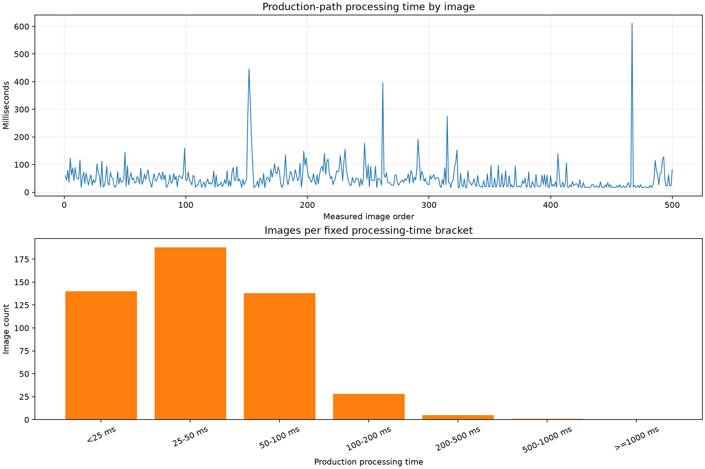
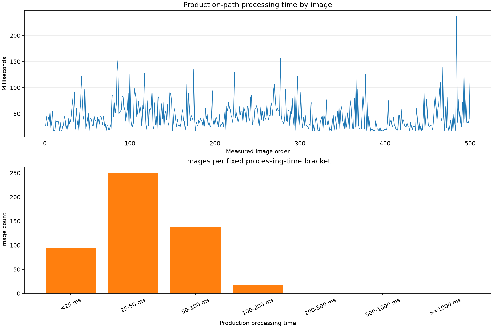

# Historical-Best Model: Two-Run Deep Evaluation

Completed 2026-07-21 16:54 -04:00.

## Outcome

The historical-best YOLO11n-seg model was evaluated exactly once on each of 1,000 leakage-free images split into two mutually exclusive, group-aware randomized 500-image runs. Predictions were cached during a production-timing pass; all LabelMe fact checking and one-to-one polygon matching happened afterward without invoking the model again.

The previous 83.56% recall / 83.22% precision result did not reproduce on these new samples. Overall recall/precision were 80.25%/76.70% in run 1 and 78.68%/72.26% in run 2. Pinhole remained materially stronger than scratch. Scratch precision was only 51.41% and 49.59%, so this checkpoint is not ready for production deployment.

## Frozen model and protocol

- Weights: `aoi_yolo/runs/core2_bg_v2_yolo11n_seg_e120_i1280_b1_from_bg_best/weights/best.pt`
- Weights SHA-256: `991ac31d4f0c06b46cf2a12d2f150dac02d8ea1eaf3431e0052cfce7fab361e5`
- Input: `imgsz=1280`, raw confidence `0.05`, `max_det=300`
- Frozen cascade: pinhole confidence/area `>=0.30`/`>=150 px`; scratch `>=0.20`/`>=300 px`
- AOI event match: class-aware one-to-one mask IoU `>=0.05`; `inpinhole` merged into `pinhole`
- Seeds: `2026072101` and `2026072102`
- Leakage audit: 907 historical train/validation images excluded by stem and SHA-256; 2,170 eligible canonical images remained
- Run separation: zero shared stems, SHA-256 hashes, or 25-image acquisition groups
- Timing starts after image decode and immediately before the image enters the model. It includes model preprocessing, synchronized GPU inference, model postprocessing/masks, prediction conversion, and the frozen cascade. Disk I/O and JSON scoring are excluded.
- CLAHE was not added to this evaluation because the selected historical checkpoint was not trained with CLAHE; changing its input transform would no longer be an evaluation of the frozen historical-best model.

## Dataset composition

| Run | Images | Pinhole positive images | Pinhole objects | Scratch positive images | Scratch objects | Total target objects |
|---|---:|---:|---:|---:|---:|---:|
| 1 | 500 | 295 | 935 | 62 | 103 | 1,038 |
| 2 | 500 | 285 | 674 | 62 | 81 | 755 |

Context membership was similar across runs (chi-square `p=0.4092`), but object multiplicity was not: mean target objects/image was 2.076 versus 1.510 (Mann-Whitney `p=0.0499`, KS `p=0.0199`). Run 1 therefore presented a heavier per-image defect load even though the broad context categories were comparable.

| Run | Pinhole only | Scratch only | Mixed | No target |
|---|---:|---:|---:|---:|
| 1 | 250 | 17 | 45 | 188 |
| 2 | 249 | 26 | 36 | 189 |

## Defect-specific accuracy

| Run | Defect | Objects / positive images | TP | FP | FN / slips | Recall (95% Wilson CI) | Precision (95% Wilson CI) | F1 | Mean matched mask IoU |
|---|---|---:|---:|---:|---:|---:|---:|---:|---:|
| 1 | Pinhole | 935 / 295 | 760 | 184 | 175 | 81.28% (78.66-83.65%) | 80.51% (77.86-82.91%) | 80.89% | 71.10% |
| 1 | Scratch | 103 / 62 | 73 | 69 | 30 | 70.87% (61.48-78.77%) | 51.41% (43.26-59.48%) | 59.59% | 69.32% |
| 1 | Overall | 1,038 / 312 | 833 | 253 | 205 | 80.25% (77.72-82.56%) | 76.70% (74.10-79.12%) | 78.44% | 70.94% |
| 2 | Pinhole | 674 / 285 | 534 | 167 | 140 | 79.23% (76.00-82.12%) | 76.18% (72.89-79.18%) | 77.67% | 75.95% |
| 2 | Scratch | 81 / 62 | 60 | 61 | 21 | 74.07% (63.60-82.37%) | 49.59% (40.83-58.37%) | 59.41% | 73.22% |
| 2 | Overall | 755 / 311 | 594 | 228 | 161 | 78.68% (75.61-81.45%) | 72.26% (69.10-75.21%) | 75.33% | 75.68% |

Every FN has a corresponding slipped-defect row: 205 in run 1 and 161 in run 2. The private result folders retain `events.csv` and `slips.csv` with stem, defect, ground-truth ID, prediction ID, confidence, and matched IoU where applicable.

None of the four per-defect recall/precision differences between runs was significant after Holm correction. Pinhole precision showed an uncorrected difference of +4.33 points in run 1 (`p=0.0340`), but its Holm-adjusted `p=0.1358`; pinhole recall and both scratch metrics were also non-significant.

## Production-path timing

| Run | Stage | Mean (ms) | P50 (ms) | P95 (ms) | Maximum (ms) |
|---|---|---:|---:|---:|---:|
| 1 | Model preprocess | 6.49 | 6.42 | 7.34 | 8.50 |
| 1 | GPU inference | 12.00 | 10.41 | 18.50 | 21.44 |
| 1 | Model postprocess | 7.53 | 5.55 | 19.22 | 120.30 |
| 1 | Conversion + cascade | 24.10 | 13.43 | 73.64 | 538.86 |
| 1 | Total production path | 50.51 | 39.94 | 115.49 | 611.35 |
| 2 | Model preprocess | 6.65 | 6.63 | 7.42 | 9.62 |
| 2 | GPU inference | 11.93 | 10.70 | 18.46 | 20.33 |
| 2 | Model postprocess | 6.46 | 5.36 | 15.79 | 39.76 |
| 2 | Conversion + cascade | 19.24 | 13.30 | 58.94 | 180.66 |
| 2 | Total production path | 44.66 | 37.53 | 92.11 | 236.86 |

### Images per fixed timing bracket

| Bracket | Run 1 count (%) | Run 2 count (%) |
|---|---:|---:|
| `<25 ms` | 140 (28.0%) | 95 (19.0%) |
| `25-50 ms` | 188 (37.6%) | 250 (50.0%) |
| `50-100 ms` | 138 (27.6%) | 137 (27.4%) |
| `100-200 ms` | 28 (5.6%) | 17 (3.4%) |
| `200-500 ms` | 5 (1.0%) | 1 (0.2%) |
| `500-1000 ms` | 1 (0.2%) | 0 |
| `>=1000 ms` | 0 | 0 |

The bracket distributions differed (`p=0.000242`). The ordinary/rank location did not materially shift: Mann-Whitney `p=0.9171`, Cliff's delta `0.0038`, and the median difference was 2.41 ms with a bootstrap 95% CI of -2.01 to 6.17 ms. The distribution shape did differ (KS `p=0.0290`) and run 1 had a heavier tail, producing a mean difference of 5.85 ms (bootstrap 95% CI 1.07-11.02 ms). This agrees with run 1's significantly higher target-object multiplicity and its larger extreme conversion/postprocess workload, rather than indicating a broad slowdown of every image.

### Timing by defect context

| Run | Context | Images | Mean (ms) | P50 (ms) | P95 (ms) | Maximum (ms) |
|---|---|---:|---:|---:|---:|---:|
| 1 | Pinhole only | 250 | 60.81 | 49.18 | 119.86 | 611.35 |
| 1 | Scratch only | 17 | 51.89 | 48.71 | 82.76 | 104.43 |
| 1 | Mixed | 45 | 101.57 | 81.75 | 173.74 | 445.83 |
| 1 | No target | 188 | 24.47 | 20.15 | 45.07 | 107.04 |
| 2 | Pinhole only | 249 | 49.65 | 42.96 | 94.52 | 236.86 |
| 2 | Scratch only | 26 | 51.16 | 43.79 | 89.17 | 134.71 |
| 2 | Mixed | 36 | 77.18 | 64.97 | 141.96 | 156.74 |
| 2 | No target | 189 | 31.00 | 25.64 | 72.52 | 126.74 |

Timing differed strongly by context in both runs (Kruskal-Wallis run 1 `p=1.22e-60`; run 2 `p=2.29e-34`). The strongest timing relationship was not defect name alone but the number of predictions requiring mask conversion: raw-prediction Spearman rho was 0.971 in run 1 and 0.969 in run 2. Total target-object count was also strongly correlated (rho 0.835 and 0.669), followed by pinhole object count (0.778 and 0.597) and scratch object count (0.365 and 0.301); all were statistically significant. Image dimensions were non-significant in run 1 (`p=0.679`) and constant in run 2, so they do not explain the observed spread.

## Timing graphs





## Verification and limitations

- Verification passed with 500 manifest/cache/timing/bracket-reconciled rows per run, 500 unique stems per cache, zero cross-run stem/hash/group overlap, exact TP/FP/FN event reconciliation, FN-to-slip reconciliation, valid cache/timing SHA-256 markers, and both timing PNGs present.
- Automated test command passed 19 tests.
- The two runs are independent by the conservative acquisition-group rule but still come from the same canonical source pool. They do not replace five grouped cross-validation folds or the final untouched production-distribution test.
- `hit_iou=0.05` measures AOI event detection and is intentionally permissive. Mean matched mask IoU is reported separately; this report does not reinterpret event recall as strict localization AP50.
- Timing intentionally excludes disk decode and ground-truth checking. CPU polygon/mask conversion and the threshold/area cascade are included because they are part of the production decision path.
- Background desktop GPU consumers were present, but no other Python trainer/evaluator was active. The measured model process was the only Python GPU workload started for these runs.
- The production C# AOI application was not modified.

## Commands

```powershell
H:\visual micro measurements\.venv_yolo\Scripts\python.exe -m aoi_yolo.historical_best_deep_eval.run_experiment --mode smoke --data-root "H:\visual micro measurements"
H:\visual micro measurements\.venv_yolo\Scripts\python.exe -m aoi_yolo.historical_best_deep_eval.run_experiment --mode execute --data-root "H:\visual micro measurements"
H:\visual micro measurements\.venv_yolo\Scripts\python.exe -m aoi_yolo.historical_best_deep_eval.verify_results --data-root "H:\visual micro measurements"
H:\visual micro measurements\.venv_yolo\Scripts\python.exe -m pytest aoi_yolo\historical_best_deep_eval\tests -q -p no:cacheprovider --basetemp "H:\visual micro measurements\tmp\pytest-historical-best-final-0721\base"
```
